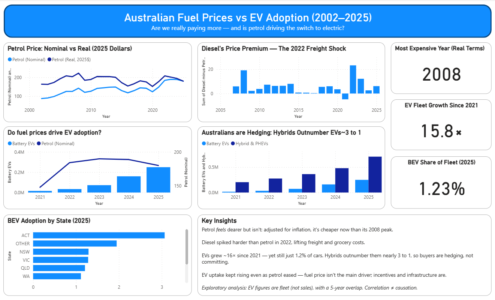

# Australian Fuel Prices vs EV Adoption (2002–2025)

An interactive Power BI dashboard examining two questions: **are Australians really paying more for fuel than a decade ago, and is the cost of petrol actually driving the switch to electric vehicles?** Built with official open data from AIP, the ABS, and the AAA Electric Vehicle Index.

## The questions

1. Fuel *feels* more expensive every year — but once you adjust for inflation, is it really?
2. Conventional wisdom says expensive petrol pushes people toward EVs. Does the data support that?

## Key findings

- **Petrol is cheaper than it feels.** Nominal pump prices roughly doubled from 2002 to 2025, but adjusted for inflation (CPI, 2025 dollars), petrol today sits *below* its 2008 real-terms peak. The pain is real, but it's mostly the broader cost of living rising — not fuel specifically.
- **Diesel drove a freight shock.** Diesel — the fuel of trucks and freight — spiked far harder than petrol in 2022, opening a ~23 c/L gap. Because diesel moves goods, that spike fed into grocery and delivery costs, linking fuel to the wider cost-of-living squeeze.
- **EV growth is fast but early.** Australia's battery-EV fleet grew ~16× between 2021 and 2025, yet BEVs are still only ~1.2% of all cars on the road.
- **Australians are hedging, not committing.** Hybrids and PHEVs outnumber pure EVs by nearly 3 to 1 — buyers are choosing fuel savings without the range anxiety, charging gaps, or price premium of full EVs.
- **Fuel price is not the main driver of EV uptake.** EV adoption kept accelerating even after petrol prices eased from 2023, and the state leading adoption (the ACT, ~3% vs ~1.3% elsewhere) leads on incentives and income, not fuel costs. Policy, model availability, and infrastructure matter more than petrol pain.

## Dashboard features

- Petrol price: nominal vs inflation-adjusted (real, 2025 dollars) — the headline
- Diesel's price premium over petrol, highlighting the 2022 freight shock
- Fuel price vs EV fleet growth overlaid (dual-axis) to test the relationship
- EVs vs hybrids — the hedging pattern
- BEV adoption by state (2025)
- Headline cards: real-terms peak year, EV fleet growth multiple, current BEV share

## Tools & techniques

- **Power BI Desktop** — modelling and dashboard
- **Power Query** — cleaning and combining three sources of differing time granularity
- **DAX** — inflation-adjustment calculated columns and summary measures
- **Inflation adjustment** — deflating nominal prices to real (2025) terms using ABS CPI

## Data sources

- Fuel prices: [Australian Institute of Petroleum](https://www.aip.com.au/aip-annual-retail-price-data) — annual retail averages
- Inflation: [ABS Consumer Price Index](https://www.abs.gov.au/statistics/economy/price-indexes-and-inflation/consumer-price-index-australia)
- EV registrations: [AAA Electric Vehicle Index](https://www.aaa.asn.au/research-data/electric-vehicle/) (sourced from FCAI and the Electric Vehicle Council)

## Honesty & limitations

Stating limitations clearly is part of doing this well:

- The EV measure is the **registered fleet on the road** (cumulative registrations), not annual sales.
- Fuel and EV data only **overlap for five years** (2021–2025), so the fuel-vs-EV comparison is exploratory, not statistical proof.
- **Correlation is not causation** — EV adoption has many interacting drivers (incentives, infrastructure, model availability, vehicle price).
- CPI figures are annual-average All Groups (ABS).

## Files

- `fuel_ev_dashboard.pbix` — the Power BI file
- `dashboard.png` — dashboard screenshot
- `fuel_ev_combined.csv` — combined annual dataset
- `ev_by_state.csv` — state-level BEV adoption (2025)

---

*Built by [Ragul Balaji Selvaraj](https://www.linkedin.com/in/ragulbalajiselvaraj) · [GitHub](https://github.com/ragul-selvaraj)*
